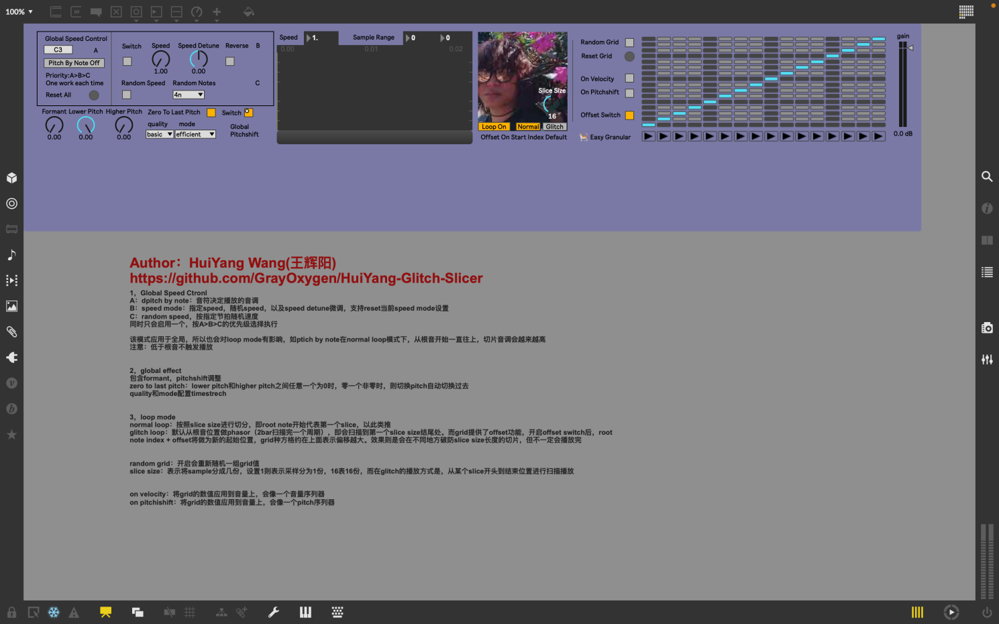

## First Max Patcher
It's a max for live patcher. It provides some basic sound modifications for sampling, such as speed, pitch, pitch shift, form, etc. It's a tool for quickly transforming sound.

[Huiyang Glitch Slicer on MaxForLive](https://maxforlive.com/library/device/9827/huiyang-glitch-slicer)

[▶ If the video cannot be opened, please click](https://drive.google.com/file/d/1I6ilv3HWo49XsHQuCnwEwtyr4df_SnCd/view?usp=sharing)

   <iframe 
    src="https://drive.google.com/file/d/1I6ilv3HWo49XsHQuCnwEwtyr4df_SnCd/preview"
    style="position: absolute; top: 0; left: 0; width: 100%; height: 100%;"
    frameborder="0"
    allow="autoplay; fullscreen; picture-in-picture; clipboard-write; encrypted-media; web-share"
    referrerpolicy="strict-origin-when-cross-origin"
    title="">
  </iframe>
  

  